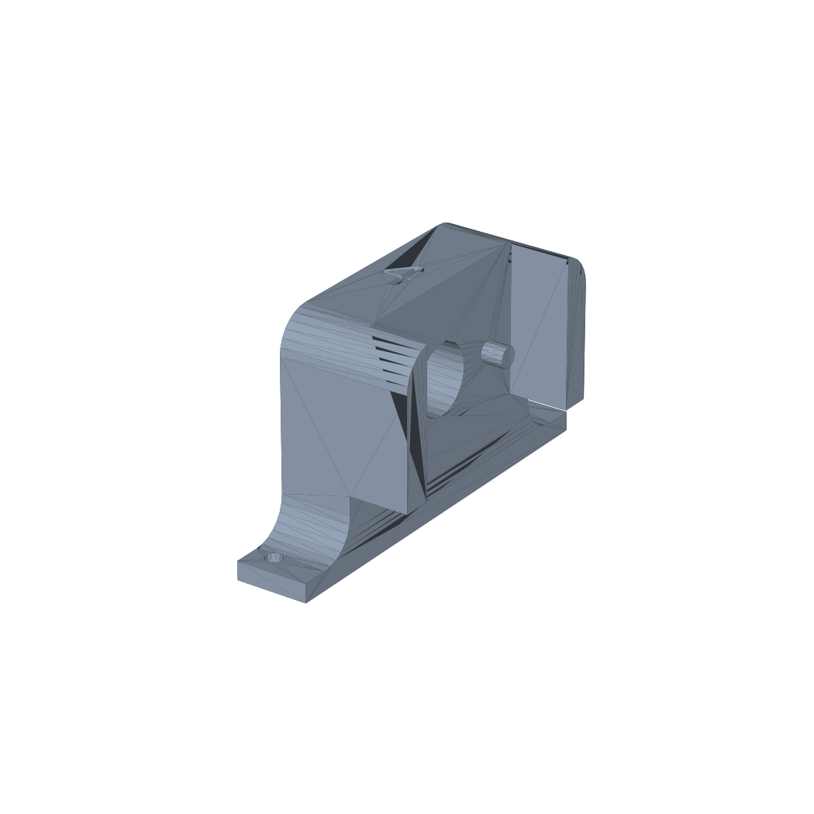
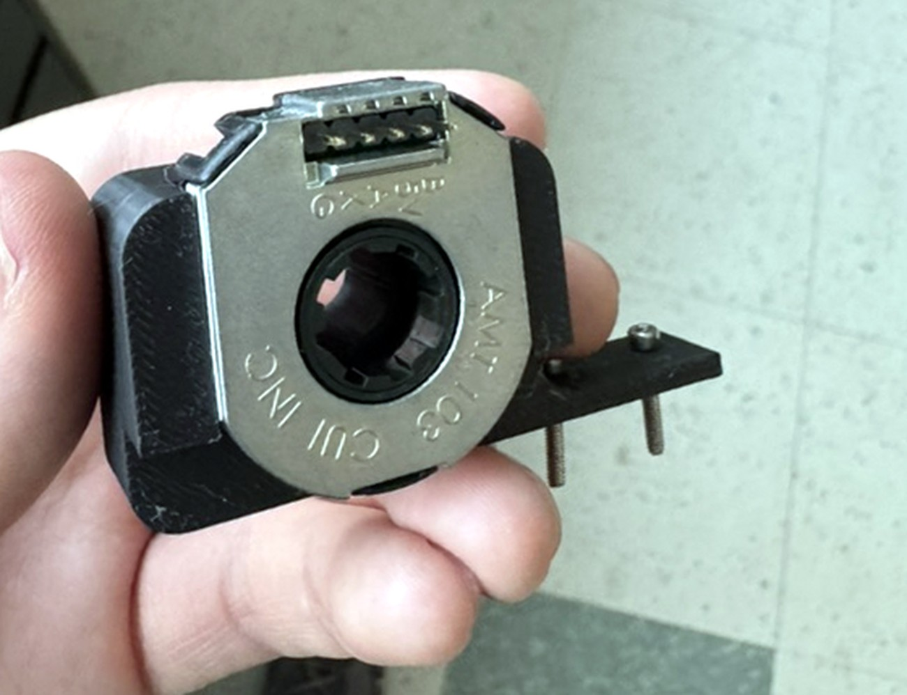
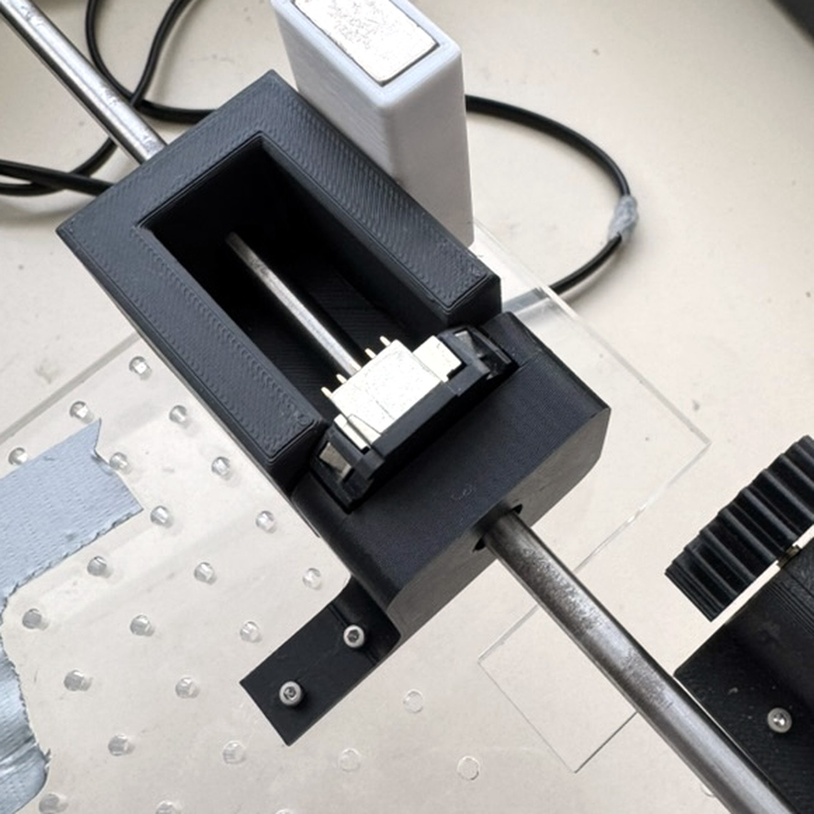
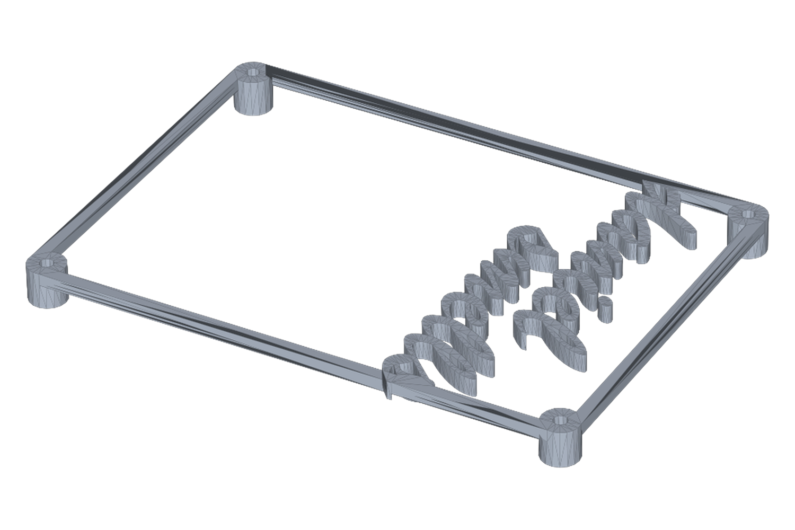
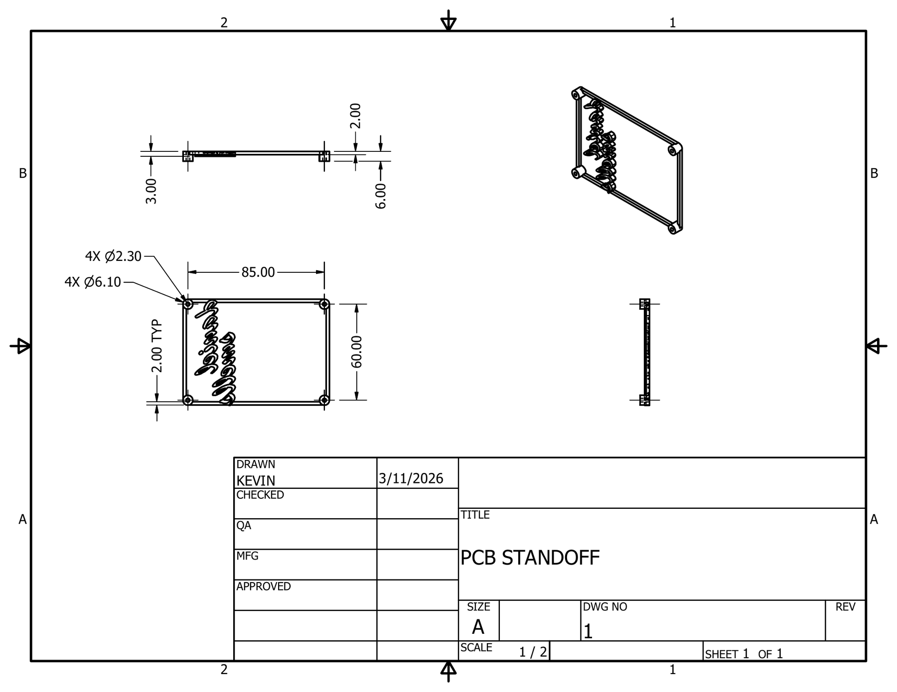
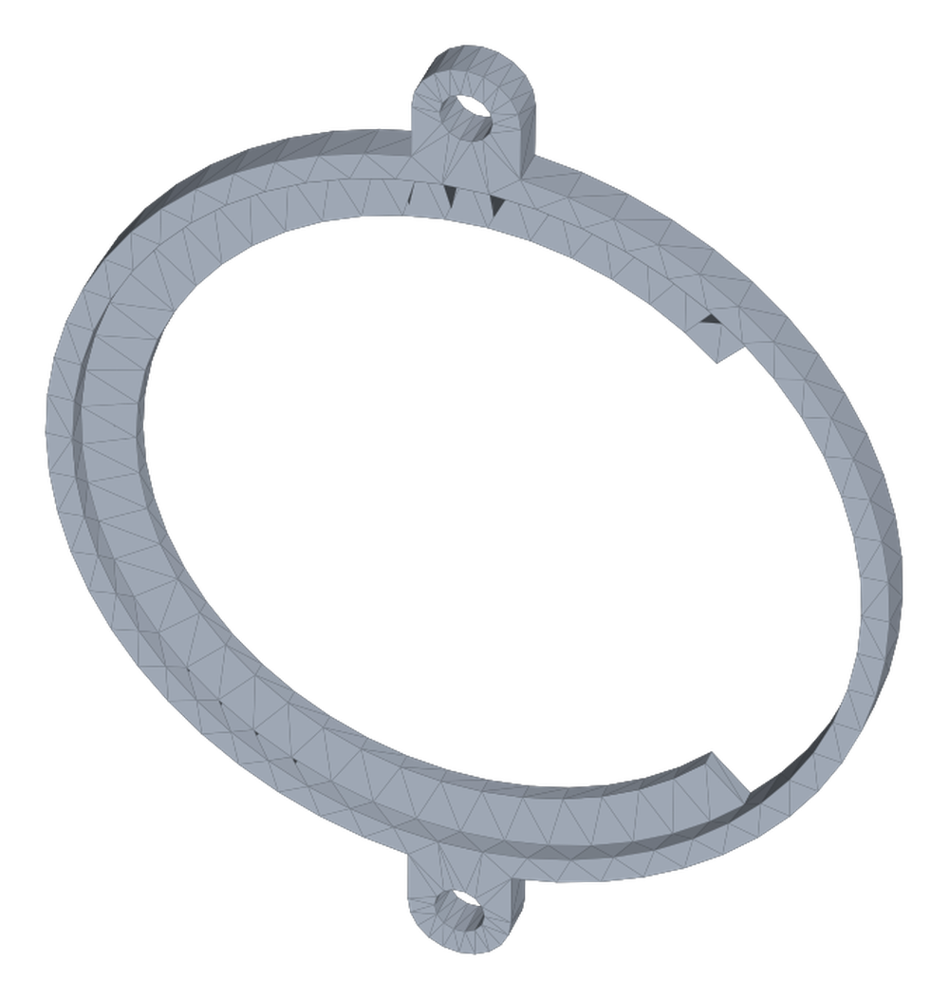
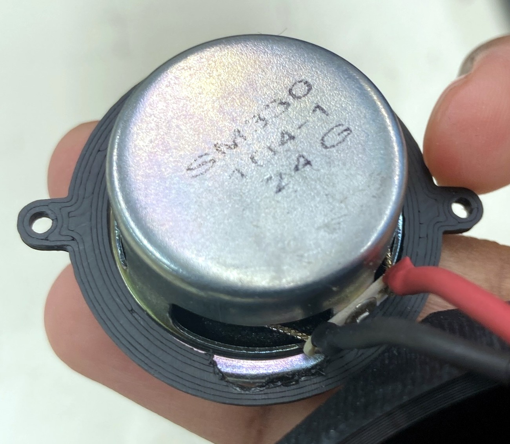
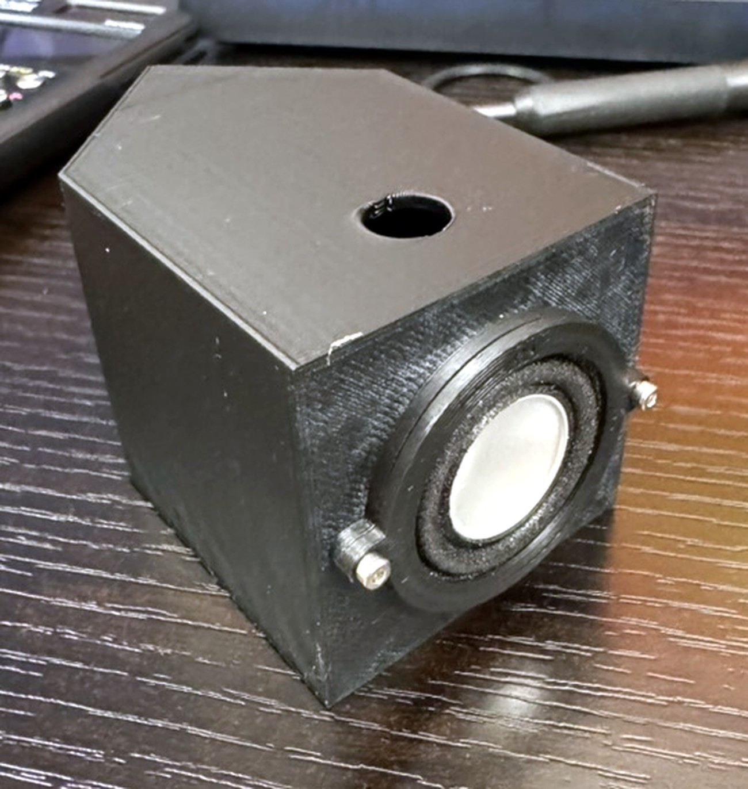

# Chem-E-Car 2025–2026

Mechanical design files for my work on the McMaster AIChE Chem-E-Car 2025-2026 entry. Every part below has an
STL you can spin in your browser — **click any `.stl` link and GitHub renders it
in 3D**.

All dimensions in millimetres. Drawings drawn by me (Kevin).
All parts are printed in PLA.

---

## Encoder mount

Bracket carrying the wheel encoder against the driveshaft.

| | |
|---|---|
| **Envelope** | 54.0 × 17.7 × 30.0 mm |
| **Key features** | Ø9.35 shaft bore, 2× Ø2.80 fasteners, 4× R5.00 fillets |
| **3D model** | [`cad/stl/encoder_mount.stl`](cad/stl/encoder_mount.stl) |
| **Drawing** | [`docs/encoder_mount_drawing.pdf`](docs/encoder_mount_drawing.pdf) |

 

  
  

<em>Printed mount carrying a CUI AMT103 encoder · installed on the driveshaft</em>

## PCB standoff

Tray that lifts pcb off the acrylic base plate and holds it at the corners.

| | |
|---|---|
| **Envelope** | 91.1 × 66.1 × 6.0 mm |
| **Mounting pattern** | 85.00 × 60.00 mm, 4× Ø2.30 through / Ø6.10 boss |
| **Standoff height** | 3.00 mm |
| **3D model** | [`cad/stl/pcb_standoff_v1.stl`](cad/stl/pcb_standoff_v1.stl) |
| **Drawing** | [`docs/pcb_standoff_v1_drawing.pdf`](docs/pcb_standoff_v1_drawing.pdf) |

 

  

<em>Dimensioned drawing — click for the PDF</em>

## Speaker clamp

1/2 of a clamp adding mounting holes to a speaker.

| | |
|---|---|
| **Envelope** | 46.8 × 37.4 × 1.8 mm |
| **Features** | 2× mounting tabs at 180°, terminal cutout for the speaker leads |
| **3D model** | [`cad/stl/speaker_clamp_v3.stl`](cad/stl/speaker_clamp_v3.stl) |
| **Drawing** | *not yet drawn* |

 

  
  

<em>Clamp fitted to the driver, tabs adding the mounting holes · driver mounted in the enclosure</em>

